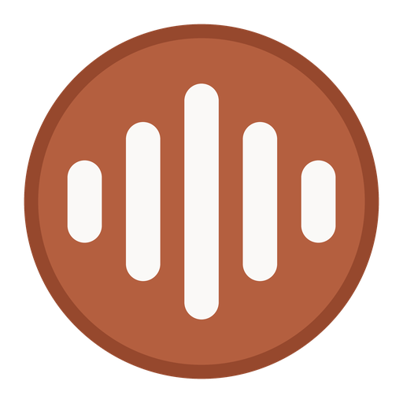

<div align="center">



# Lifelog

**Diário de áudio com transcrição local.**

Grava o microfone e o áudio do sistema, transcreve tudo no seu computador
e gera relatórios do seu dia.

[](https://github.com/joaosouz4dev/lifelog/releases/latest)

</div>

---

## O que é

Você fala o dia inteiro — em reuniões, chamadas, pensando alto. Quase nada
disso fica registrado. O Lifelog grava, transcreve e organiza, para você poder
buscar o que foi dito e ler um resumo no fim do dia.

Tudo acontece **no seu computador**. A transcrição roda localmente com o
Whisper; nada é enviado para a internet a menos que você configure.

## Instalação

Baixe o instalador na [página de releases](https://github.com/joaosouz4dev/lifelog/releases/latest)
e execute. O ícone aparece na bandeja e a captura começa sozinha.

Abra **http://localhost:8000** para ver a timeline e os relatórios.

> Na primeira transcrição o modelo de reconhecimento de fala (~3 GB) é baixado
> uma vez. Enquanto isso o áudio fica em fila e nada se perde.

## Como funciona

```
captura → VAD → Opus → fila local → servidor → transcrição → timeline / relatórios
```

O VAD (Silero) descarta silêncio antes de qualquer coisa subir. Em medição
real isso removeu **86% do áudio** mantendo toda a fala — é o que torna viável
gravar o dia inteiro sem encher o disco.

## Netflix não entra no relatório

O sistema identifica qual programa está emitindo som e classifica cada trecho:

| Origem | Vai para o relatório? |
|---|---|
| Teams, Zoom, Discord, Slack | sim |
| Netflix, Spotify, VLC, jogos | **não** |
| Navegador | sim — pode ser Meet |
| Microfone | sempre |

Uma reunião com música ao fundo continua contando como reunião: perder a
reunião seria o erro mais caro.

## Privacidade

Gravar o áudio do sistema captura vozes de terceiros em chamadas. No Brasil,
gravar uma conversa da qual você participa é legal (STF, RE 583937), mas
armazenar e transcrever terceiros pede cuidado sob a LGPD.

O que o Lifelog oferece:

- **Pausa sempre à mão** — clique duplo no ícone da bandeja
- **Transcrição 100% local** por padrão
- **Retenção configurável** — apaga o áudio após N dias, preserva a transcrição
- Seus dados ficam em `%LOCALAPPDATA%\Lifelog` e não saem dali

## Relatórios com IA (opcional)

Desligado por padrão. Para ativar, configure um provedor em
`%LOCALAPPDATA%\Lifelog\config.local.yaml`:

```yaml
llm:
  providers:
    claude:
      enabled: true
      api_key: ${ANTHROPIC_API_KEY}
```

Um relatório diário custa cerca de 18 centavos de dólar com `claude-sonnet-5`.
Se preferir custo zero, ative o `ollama` — a cadeia funciona igual, com
fallback automático entre provedores.

## Rodar a partir do código

```bash
pip install -r requirements.txt
```

```bash
uvicorn server.main:app --host 0.0.0.0 --port 8000
```

```bash
python windows-client/tray.py
```

Com `--host 0.0.0.0` a interface também abre no celular pela rede local.

### Testes

```bash
python -m pytest tests/ -q
```

Cobrem o fallback entre provedores, o teto de gasto, a idempotência da
ingestão, a fila local com servidor offline, o VAD com fala real e a
classificação por origem do áudio.

### Estrutura

```
server/          FastAPI, banco, hub de provedores, relatórios
  hub/           interface de provedores, fallback, custos
  reports/       montagem de contexto e prompts
  web/           interface (timeline, relatórios, busca)
windows-client/  captura WASAPI, VAD, fila local, bandeja
protocol/        contrato de ingestão — base para Android e gadget
```

## Estado

Funciona no Windows. O protocolo de ingestão em
[protocol/ingest.md](protocol/ingest.md) foi escrito para receber um app
Android e um gadget dedicado sem mudanças no servidor.

Duas limitações que valem saber antes de contar com elas:

- **No Android não dá para gravar chamadas** — Google bloqueou por política e
  no sistema desde 2022.
- **Áudio de apps com DRM não é capturável** — Spotify e Netflix fazem opt-out
  do `AudioPlaybackCapture`.

## Licença

MIT
